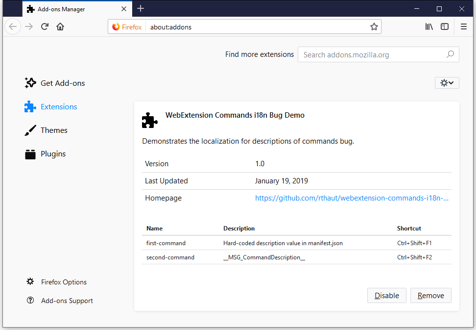

# webextension-commands-i18n-bug

This extension demonstrates how the `description` property of registered commands in the `manifest.json` file is **not** correctly internationalized using the [documented `__MSG_ + messageName + __` format](https://developer.mozilla.org/en-US/docs/Mozilla/Add-ons/WebExtensions/Internationalization#Internationalizing_manifest.json).

The extension can be installed manually into firefox, or the [`web-ext` tool](https://github.com/mozilla/web-ext) can be used to automatically install the extension. Simply run the following commands (aftering download or cloning this repo):

```sh
npm install
npm run test
```

Open the Extension's option page (opened by default on first install), and note how the first command, which uses a hard-coded description, displays as expected, but the second command's description is **not** using the localized string.


